# Sales Flow — 55 Mermaid Diagrams (Updated)

> 11 Flows × 5 Diagram Types = **55 Diagrams**
> Diagram Types: Data Flow · Sequence · User Interaction · Function Calls · Reactivity
>
> **Updated to reflect current architecture:**
> - `StepTransitionPipelineService` fully implemented (single source of truth for step transitions)
> - `SimpleCssPickerComponent` uses `facade.loadAndEvaluateStep()` — single orchestrating call
> - Pre-navigation skip loop lives in `pipeline.trySkipAndNavigate()` — no post-load skip
> - `SalesFlowFooterService` uses `TaskFlowType` detection + `SalesFlowValidationService`
> - `SalesFlowNavigationService` is now a thin delegator

---

# ═══════════════════════════════════════════════
# FLOW 1: Pick → Match → Config → Checkout (Very High Level)
# ═══════════════════════════════════════════════

## 1.1 — Data Flow

```mermaid
flowchart LR
    subgraph "Step 1: PICK"
        A1[ProductsAndServicesService.getProducts] -->|ProductOfferingExtended[]| B1[SimpleCssPickerComponent]
        B1 -->|selectedProduct| C1[ProductSelectionStateService.selectItem]
        C1 -->|CartItemExtended| D1[SalesFlowStateService via SalesFlowFacadeService.addProduct]
    end
    subgraph "Step 2: MATCH"
        E1[ProductMatchService.fetchMatchResults] -->|matched packages| F1[SimpleCssPickerComponent matcher mode]
        F1 -->|selectedPackage| G1[ProductSelectionStateService.selectItem]
        G1 -->|QPC created| H1[StepTransitionPipelineService.buildQpcFromPackage]
    end
    subgraph "Step 3: CONFIG"
        H1 -->|QPC| I1[QpcConfigurationAnalyzerService.analyzeConfigurationRequirements]
        I1 -->|QpcConfigurationRequirement[]| J1[CharacteristicConfigurationComponent]
        J1 -->|characteristic values| K1[ConfigurationNavigationService.storeCharacteristicValue]
        K1 -->|apply to QPC| L1[QpcApiService.computeQpcForShoppingCart]
    end
    subgraph "Step 4: CHECKOUT"
        L1 -->|validated QPC| M1[PickedProductsBuilderServiceExtended.validateAndSubmitCart]
        M1 -->|order submitted| N1[Router → order-confirmation]
    end
```

## 1.2 — Sequence

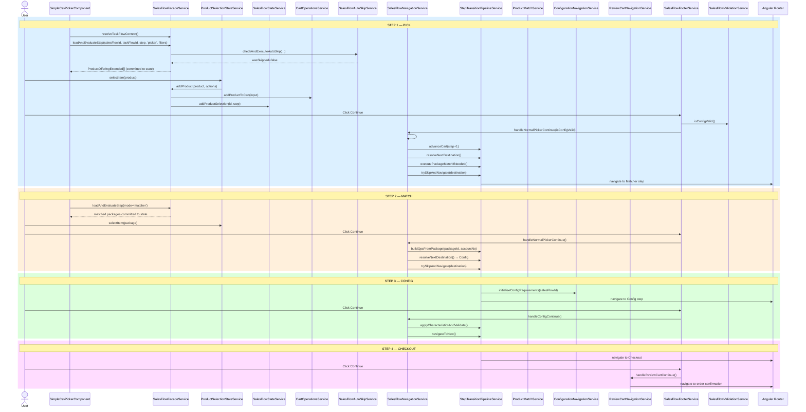

## 1.3 — User Interaction

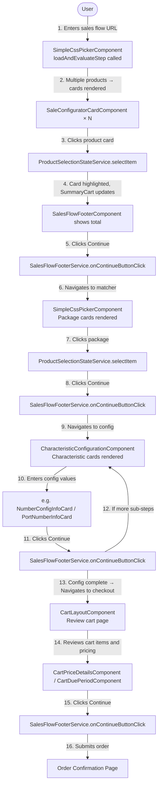

## 1.4 — Function Calls

```mermaid
flowchart TD
    subgraph "PICK Phase"
        A[SimpleCssPickerComponent.ngOnInit] --> B[loadTaskFlowContext]
        B --> C[SalesFlowFacadeService.resolveTaskFlowContext]
        A --> D[loadItemsFromTaskFlow]
        D --> E[SalesFlowFacadeService.loadAndEvaluateStep]
        E --> F[loadStepProducts deferStateUpdate:true]
        E --> G[evaluateAutoSkipForStep → AutoSkip.checkAndExecuteAutoSkip]
        E --> H[finalizeStepProducts → state committed]
        I[onConfiguratorCardProductSelected] --> J[ProductSelectionStateService.selectItem]
        J --> K[SalesFlowFacadeService.addProduct]
        K --> L[CartOperationsService.addProductToCart]
        K --> M[SalesFlowStateService.addProductSelection]
    end
    subgraph "Continue → MATCH Phase"
        N[SalesFlowFooterService.onContinueButtonClick] --> O[handleContinueButtonEvent]
        O --> O1[SalesFlowValidationService.isConfigValid]
        O --> P[SalesFlowNavigationService.handleNormalPickerContinue]
        P --> Q[#validateAndProcessSelections]
        P --> R[#pickProductsForCurrentStep → Manager.selectProducts → PMSvc.pick]
        P --> S[Pipeline.advanceCart]
        P --> T[Pipeline.resolveNextDestination]
        P --> U[Pipeline.executePackageMatchIfNeeded if next=Matcher]
        P --> V[Pipeline.trySkipAndNavigate]
    end
    subgraph "CONFIG Phase"
        W[CharacteristicConfigurationComponent constructor effect] --> X[ConfigurationFacadeService.analyzeRequirements]
        X --> Y[QpcConfigurationAnalyzerService.analyzeConfigurationRequirements]
        Z[FooterService.handleConfigurationContinue] --> AA[NavSvc.handleConfigContinue]
        AA --> AB[Pipeline.applyCharacteristicsAndValidate]
        AB --> AC[ConfigNav.applyCharacteristicsAndValidate]
        AC --> AD[QpcApiService.computeQpcForShoppingCart]
        AA --> AE[Pipeline.navigateToNext → NavCoord.navigateToNext]
    end
    subgraph "CHECKOUT Phase"
        AF[FooterService.isCartCreationMode → getCurrentTaskFlowType=Checkout] --> AG[handleReviewCartContinue]
        AG --> AH[ReviewCartNavigationService.handleReviewCartContinue]
        AH --> AI[PickedProductsBuilderExtended.validateAndSubmitCart]
        AI --> AJ[Router.navigate → order-confirmation]
    end
```

## 1.5 — Reactivity

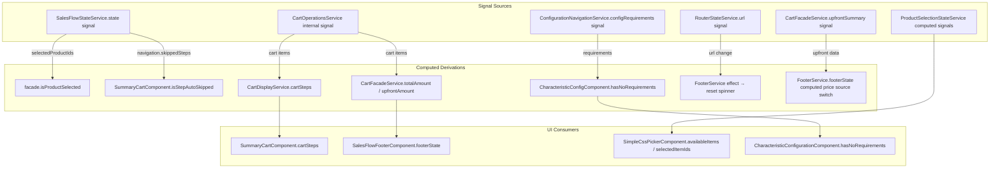

---

# ═══════════════════════════════════════════════
# FLOW 2: Pick Breakdown — Product Match Token Logic
# ═══════════════════════════════════════════════

## 2.1 — Data Flow

```mermaid
flowchart TD
    A[User selects product in SimpleCssPickerComponent] -->|product| B[ProductSelectionStateService.selectItem]
    B -->|delegates| C[SalesFlowFacadeService.addProduct]
    C -->|CartOperationResult| D[CartOperationsService.addProductToCart]
    C -->|productId, stepNumber| E[SalesFlowStateService.addProductSelection]
    C -->|stepNumber, productId| F[SalesFlowStateService.saveStepSelection]

    G[User clicks Continue] --> H[SalesFlowFooterService.onContinueButtonClick]
    H --> I[SalesFlowNavigationService.handleNormalPickerContinue]
    I --> I1[#pickProductsForCurrentStep]
    I1 -->|filters non-package IDs from state| J[SalesFlowStateService.state.selectedProductIds filtered by stepNumber]
    J -->|filtered productIds| K[SalesFlowManagerService.selectProducts productIds step taskFlowId]
    K -->|POST /pick API| L[ProductMatchService.pick productIds taskFlowId]
    L -->|response contains token| M[ProductMatchService stores per-step token: Map taskFlowId → token]

    M -->|token persisted| N[Pipeline.resolveNextDestination]
    N -->|next is Matcher?| O{Is next step Matcher?}
    O -->|Yes| P[Pipeline.executePackageMatchIfNeeded called by NavSvc before trySkipAndNavigate]
    P -->|GET /matchResults<br/>interceptor attaches latest token| Q[ProductMatchService.fetchMatchResults]
    Q -->|matched ProductOfferingExtended[]| R[trySkipAndNavigate → navigate to Matcher step]
    O -->|No| S[trySkipAndNavigate → navigate to next Picker/Config/Checkout]
```

## 2.2 — Sequence

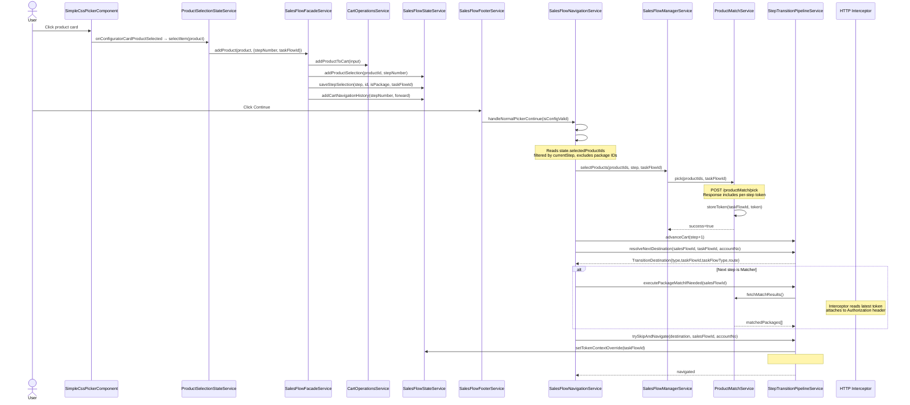

## 2.3 — User Interaction

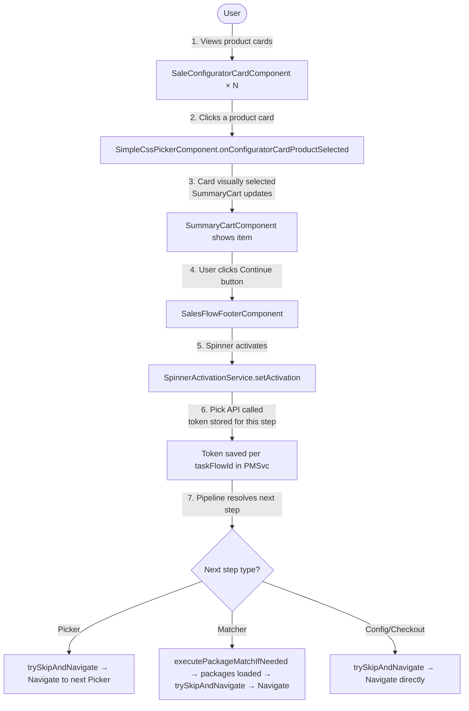

## 2.4 — Function Calls

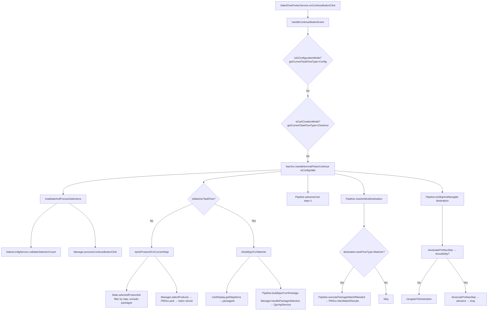

## 2.5 — Reactivity

```mermaid
flowchart TD
    subgraph "Token Storage (Imperative)"
        A[ProductMatchService.pick API call] -->|stores| B[internal Map: taskFlowId → token]
    end
    subgraph "Token Context Override (Signal)"
        C[SalesFlowStateService.tokenContextOverride signal]
        D[Pipeline.trySkipAndNavigate] -->|sets per iteration| C
        C -->|read by| E[HTTP Interceptor resolves correct token]
        F[Pipeline finishes loop] -->|sets null| C
    end
    subgraph "Product Selection Signals"
        G[ProductSelectionStateService.selectedItemIds signal]
        H[ProductSelectionStateService.availableItems signal]
        G -->|drives| I[SimpleCssPickerComponent selectedItemIdsSet → card highlights]
        H -->|drives| J[SaleConfiguratorCardComponent rendering]
    end
    subgraph "State Propagation"
        K[SalesFlowStateService.state.selectedProductIds]
        K -->|read during continue| L[NavSvc.#pickProductsForCurrentStep filters by stepNumber]
    end
```

---

# ═══════════════════════════════════════════════
# FLOW 3: Pick with Auto Skip (Component-Level)
# ═══════════════════════════════════════════════

## 3.1 — Data Flow

```mermaid
flowchart TD
    A[SimpleCssPickerComponent.ngOnInit] --> B[SalesFlowFacadeService.loadAndEvaluateStep<br/>internally: loadStepProducts deferStateUpdate:true]
    B -->|items: ProductOfferingExtended[]| C{items.length === 1 and canSkipTask=true?}
    C -->|Yes → evaluateAutoSkipForStep| D[SalesFlowAutoSkipService.checkAndExecuteAutoSkip]
    D --> E[evaluatePickerSkip → shouldSkip:true, reason:single-item]
    E --> F[executePickerAutoSkip]
    F --> F1[markStepAsAutoSkipped → State.addSkippedStep]
    F --> F2[Manager.selectProducts → ProductMatchService.pick → token stored]
    F --> F3[#addToCart → CartOperationsService.addProductToCart + State updates]
    F --> F4[Pipeline.advanceCart step+1]
    F --> F5[Pipeline.resolveNextDestination]
    F --> F6[Pipeline.trySkipAndNavigate → may chain-skip next step]
    C -->|No| G[finalizeStepProducts → state committed → spinner hides → cards render]
    G -->|#skipResolved stays false| H[User sees product cards]
```

## 3.2 — Sequence

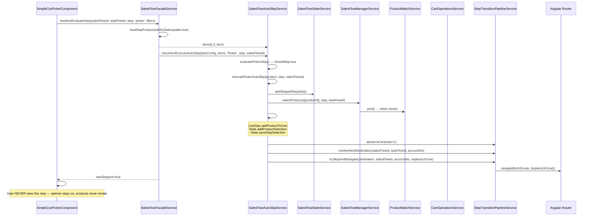

## 3.3 — User Interaction

```mermaid
flowchart TD
    U([User]) -->|1. URL navigates to step| A[SimpleCssPickerComponent initializes]
    A -->|2. Spinner shown| B[Loading spinner visible]
    B -->|3. loadAndEvaluateStep called → 1 product returned| C{canSkipTask=true?}
    C -->|Yes| D[Product auto-selected invisibly<br/>Pick API called<br/>Cart updated]
    D -->|4. trySkipAndNavigate → replaceUrl:true| E[Next step loads]
    E -->|5. User sees next step directly| F[User never saw the skipped step]
    C -->|No| G[finalizeStepProducts → cards render → user selects manually]
    Note over B,D: User only sees spinner briefly then next step appears
```

## 3.4 — Function Calls

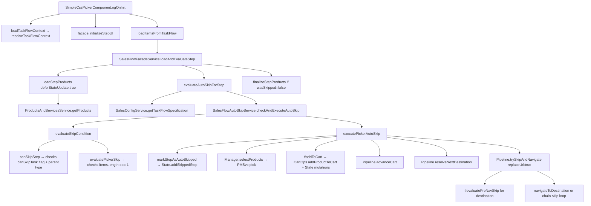

## 3.5 — Reactivity

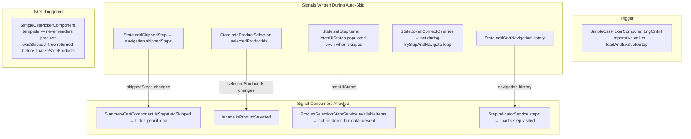

---

# ═══════════════════════════════════════════════
# FLOW 4: Pick without Auto Skip
# ═══════════════════════════════════════════════

## 4.1 — Data Flow

```mermaid
flowchart TD
    A[SimpleCssPickerComponent.ngOnInit] --> B[SalesFlowFacadeService.loadAndEvaluateStep<br/>internally: loadStepProducts deferStateUpdate:true]
    B -->|items: ProductOfferingExtended[] — multiple items| C[evaluateAutoSkipForStep → wasSkipped=false]
    C --> D[SalesFlowFacadeService.finalizeStepProducts]
    D --> E[SalesFlowStateService.setStepItems → products visible in UI]
    D --> F[SalesFlowStateService.setStepLoading false → spinner hides]
    F --> G[ProductSelectionStateService.availableItems signal updates]
    G --> H[SimpleCssPickerComponent template renders SaleConfiguratorCards]
    H -->|User picks| I[ProductSelectionStateService.selectItem]
    I --> J[SalesFlowFacadeService.addProduct]
    J --> K[CartOperationsService.addProductToCart]
    J --> L[SalesFlowStateService.addProductSelection]
```

## 4.2 — Sequence

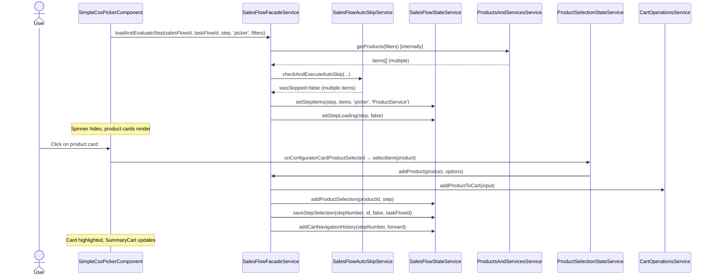

## 4.3 — User Interaction

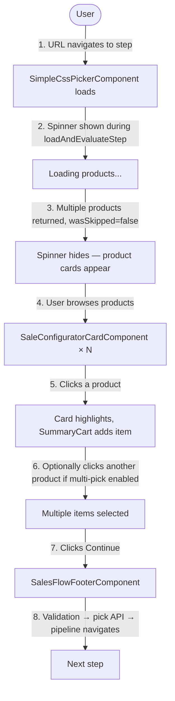

## 4.4 — Function Calls

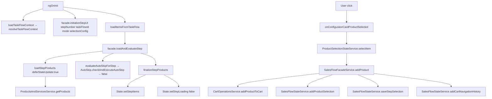

## 4.5 — Reactivity

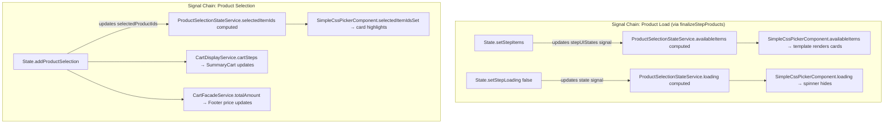

---

# ═══════════════════════════════════════════════
# FLOW 5: Pick until Package Match
# ═══════════════════════════════════════════════

## 5.1 — Data Flow

```mermaid
flowchart TD
    subgraph "Picker Step 1"
        A1[loadAndEvaluateStep → multiple products] --> B1[User selects product A]
        B1 --> C1[Continue → Pick API → token1 stored for taskFlow1]
    end
    subgraph "Picker Step 2 (if exists)"
        C1 -->|Pipeline.trySkipAndNavigate → navigate| D1[loadAndEvaluateStep step2 → multiple products]
        D1 --> E1[User selects product B]
        E1 --> F1[Continue → Pick API → token2 stored for taskFlow2]
    end
    subgraph "Transition to Matcher"
        F1 -->|NavSvc.resolveNextDestination = Matcher| G1[NavSvc calls Pipeline.executePackageMatchIfNeeded before trySkipAndNavigate]
        G1 --> H1[ProductMatchService.fetchMatchResults — interceptor attaches latest token]
        H1 -->|matched packages| I1[trySkipAndNavigate → Navigate to Matcher step]
        I1 --> J1[SimpleCssPickerComponent loadAndEvaluateStep matcher mode]
        J1 -->|matched ProductOfferingExtended[]| K1[Package cards displayed]
    end
```

## 5.2 — Sequence

```mermaid
sequenceDiagram
    actor User
    participant Picker as SimpleCssPickerComponent
    participant NavSvc as SalesFlowNavigationService
    participant Manager as SalesFlowManagerService
    participant PMSvc as ProductMatchService
    participant Pipeline as StepTransitionPipelineService
    participant SalesConfig as SalesConfigurationService
    participant Router as Angular Router

    rect rgb(220,240,255)
    Note over User,Router: Picker Step 1
    User->>Picker: Select product A
    User->>NavSvc: Continue clicked → handleNormalPickerContinue
    NavSvc->>Manager: selectProducts([prodA.id], step1, taskFlow1) via #pickProductsForCurrentStep
    Manager->>PMSvc: pick([prodA.id], taskFlow1)
    PMSvc->>PMSvc: storeToken(taskFlow1, token1)
    NavSvc->>Pipeline: advanceCart(step1+1)
    NavSvc->>Pipeline: resolveNextDestination(salesFlowId, taskFlow1, accountNo)
    Pipeline->>SalesConfig: getNextTaskFlow() → taskFlow2 (Picker)
    Pipeline-->>NavSvc: {type:'task-flow', taskFlowType:'Picker'}
    NavSvc->>Pipeline: trySkipAndNavigate → navigate to Picker step 2
    end

    rect rgb(255,240,220)
    Note over User,Router: Picker Step 2
    User->>Picker: Select product B
    User->>NavSvc: Continue clicked → handleNormalPickerContinue
    NavSvc->>Manager: selectProducts([prodB.id], step2, taskFlow2)
    Manager->>PMSvc: pick([prodB.id], taskFlow2)
    PMSvc->>PMSvc: storeToken(taskFlow2, token2)
    NavSvc->>Pipeline: resolveNextDestination() → taskFlow3 (Matcher)
    Pipeline-->>NavSvc: {type:'task-flow', taskFlowType:'Matcher'}
    NavSvc->>Pipeline: executePackageMatchIfNeeded(salesFlowId)
    Pipeline->>PMSvc: fetchMatchResults() — interceptor uses latest token
    PMSvc-->>Pipeline: matchedPackages[]
    NavSvc->>Pipeline: trySkipAndNavigate → navigate to Matcher
    Pipeline->>Router: navigate to Matcher URL
    end
```

## 5.3 — User Interaction

```mermaid
flowchart TD
    U([User]) -->|1. Step 1: Pick product| P1[Product A selected]
    P1 -->|2. Continue| T1[Token1 stored → pipeline navigates to step 2]
    T1 -->|3. Step 2: Pick product| P2[Product B selected]
    P2 -->|4. Continue| T2[Token2 stored → package match API called → navigate to Matcher]
    T2 -->|5. Matched packages loaded| M[Matcher step: Package cards displayed]
    M -->|6. User selects package| M2[Package selected]
```

## 5.4 — Function Calls

```mermaid
flowchart TD
    A[handleNormalPickerContinue Step1] --> B[#pickProductsForCurrentStep]
    B --> C[Manager.selectProducts → PMSvc.pick → token1]
    A --> D[Pipeline.advanceCart step+1]
    A --> E[Pipeline.resolveNextDestination → Picker step2]
    A --> F[Pipeline.trySkipAndNavigate → navigate to step2]

    G[handleNormalPickerContinue Step2] --> H[#pickProductsForCurrentStep]
    H --> I[Manager.selectProducts → PMSvc.pick → token2]
    G --> J[Pipeline.advanceCart step+1]
    G --> K[Pipeline.resolveNextDestination → Matcher]
    K -->|taskFlowType=Matcher| L[NavSvc calls Pipeline.executePackageMatchIfNeeded]
    L --> M[ProductMatchService.fetchMatchResults]
    G --> N[Pipeline.trySkipAndNavigate → navigate to Matcher]
```

## 5.5 — Reactivity

```mermaid
flowchart TD
    subgraph "Token Management (Imperative — NOT signal-based)"
        A[PMSvc.pick step1] -->|stores| B[tokenMap: taskFlow1→token1]
        C[PMSvc.pick step2] -->|stores| D[tokenMap: taskFlow2→token2]
        E[PMSvc.fetchMatchResults] -->|reads latest token from Map| F[HTTP request with token header]
    end
    subgraph "State Signals Across Steps"
        G[State.selectedProductIds]
        G -->|step1 entry| H[step1: prodA]
        G -->|step2 entry| I[step2: prodB]
        G -->|consumed by| J[SummaryCartComponent shows both items]
    end
    subgraph "Navigation Signal"
        K[State.addCartNavigationHistory step+1] -->|navigation signal| L[StepIndicatorService.steps updates step indicators]
    end
```

---

# ═══════════════════════════════════════════════
# FLOW 6: Pick → Match + Config
# ═══════════════════════════════════════════════

## 6.1 — Data Flow

```mermaid
flowchart TD
    subgraph "PICK"
        A[loadAndEvaluateStep → multiple products] --> B[User selects]
        B --> C[Continue → Pick API → token]
    end
    subgraph "MATCH"
        C -->|NavSvc calls executePackageMatchIfNeeded| D[Package match API with token]
        D -->|trySkipAndNavigate → navigate to Matcher| E[User selects package]
        E --> F[Continue → NavSvc.#buildQpcForMatcher]
        F --> G[Pipeline.buildQpcFromPackage → Manager.handlePackageSelection]
        G --> H[QueryProductConfigurationApiService.computeQpcForShoppingCart → QPC created]
    end
    subgraph "CONFIG"
        H -->|Pipeline.navigateToNextTaskFlow| I[ConfigNav.initialiseConfigRequirements]
        I --> J[QpcConfigurationAnalyzerService.analyzeConfigurationRequirements]
        J -->|QpcConfigurationRequirement[]| K[CharacteristicConfigurationComponent]
        K -->|info card loads| L[e.g. NumberConfigInfoCard / SimConfigInfoCard]
        L -->|user enters value| M[ConfigurationNavigationService.storeCharacteristicValue]
        M -->|Continue| N[NavSvc.handleConfigContinue → Pipeline.applyCharacteristicsAndValidate]
        N --> O[QpcApiService.computeQpcForShoppingCart updated QPC]
        O -->|sub-steps?| P{More config sub-steps?}
        P -->|Yes| K
        P -->|No| Q[Pipeline.navigateToNext → NavCoord → next step]
    end
```

## 6.2 — Sequence

```mermaid
sequenceDiagram
    actor User
    participant Picker as SimpleCssPickerComponent
    participant Footer as SalesFlowFooterService
    participant NavSvc as SalesFlowNavigationService
    participant Pipeline as StepTransitionPipelineService
    participant PMSvc as ProductMatchService
    participant Manager as SalesFlowManagerService
    participant QPC as QueryProductConfigurationApiService
    participant ConfigNav as ConfigurationNavigationService
    participant NavCoord as NavigationCoordinatorService

    rect rgb(220,240,255)
    Note over User,NavCoord: PICK
    User->>Picker: Select product
    User->>Footer: Continue
    Footer->>NavSvc: handleNormalPickerContinue()
    NavSvc->>Manager: selectProducts() → token stored
    NavSvc->>Pipeline: resolveNextDestination() → Matcher
    NavSvc->>Pipeline: executePackageMatchIfNeeded()
    NavSvc->>Pipeline: trySkipAndNavigate → navigate to Matcher
    end

    rect rgb(255,240,220)
    Note over User,NavCoord: MATCH
    User->>Picker: Select package
    User->>Footer: Continue
    Footer->>NavSvc: handleNormalPickerContinue()
    NavSvc->>Pipeline: buildQpcFromPackage(packageId, accountNo) [via #buildQpcForMatcher]
    Pipeline->>Manager: handlePackageSelection()
    Manager->>QPC: computeQpcForShoppingCart()
    QPC-->>Manager: QPC with computed items
    NavSvc->>Pipeline: resolveNextDestination() → Config
    NavSvc->>Pipeline: trySkipAndNavigate → #evaluatePreNavSkip(Config)
    Pipeline->>ConfigNav: initialiseConfigRequirements(salesFlowId)
    Note over Pipeline: configRequirements.length > 0 → not skippable
    Pipeline->>NavSvc: navigate to Config step via navigateToNextTaskFlow
    end

    rect rgb(220,255,220)
    Note over User,NavCoord: CONFIG
    loop Each sub-step
        User->>Footer: Continue
        Footer->>NavSvc: handleConfigContinue()
        NavSvc->>Pipeline: applyCharacteristicsAndValidate()
        NavSvc->>Pipeline: navigateToNext()
        Pipeline->>NavCoord: navigateToNext()
    end
    end
```

## 6.3 — User Interaction

```mermaid
flowchart TD
    U([User]) -->|1. Pick product → Continue| A[Picker step]
    A -->|2. Packages matched → displayed| B[Matcher step]
    B -->|3. Select package → Continue| C[QPC created via buildQpcFromPackage]
    C -->|4. Config requirements analyzed| D[Config step — sub-step 1<br/>e.g. Number selection]
    D -->|5. Enter value → Continue| E{More sub-steps?}
    E -->|Yes| F[Config step — sub-step 2<br/>e.g. SIM configuration]
    F -->|6. Enter value → Continue| E
    E -->|No| G[Next step in flow]
```

## 6.4 — Function Calls

```mermaid
flowchart TD
    subgraph "Pick → Match transition"
        A[handleNormalPickerContinue] --> B[#pickProductsForCurrentStep → selectProducts → pick API]
        A --> C[Pipeline.resolveNextDestination → Matcher]
        A --> D[Pipeline.executePackageMatchIfNeeded]
        A --> E[Pipeline.trySkipAndNavigate → navigate to Matcher]
    end
    subgraph "Match → Config transition"
        F[handleNormalPickerContinue on Matcher] --> G[#buildQpcForMatcher]
        G --> H[Pipeline.buildQpcFromPackage]
        H --> I[Manager.handlePackageSelection]
        I --> J[QpcApiService.computeQpcForShoppingCart]
        F --> K[Pipeline.resolveNextDestination → Config]
        K --> L[Pipeline.trySkipAndNavigate]
        L --> L1[#evaluatePreNavSkip Config → ConfigNav.initialiseConfigRequirements]
        L --> L2[reqs > 0 → not skippable → navigateToNextTaskFlow]
        L2 --> M[Pipeline.navigateToNextTaskFlow]
        M --> N[ConfigNav.initialiseConfigRequirements already done]
        M --> O[NavCoord.navigate with subStep and characteristicName queryParams]
    end
    subgraph "Config sub-step processing"
        P[FooterService.handleConfigurationContinue] --> Q[NavSvc.handleConfigContinue]
        Q --> R[Pipeline.applyCharacteristicsAndValidate]
        R --> S[ConfigNav.applyCharacteristicsAndValidate]
        S --> T[QpcApiService.computeQpcForShoppingCart]
        Q --> U[Pipeline.navigateToNext]
        U --> V[NavCoord.navigateToNext]
    end
```

## 6.5 — Reactivity

```mermaid
flowchart TD
    subgraph "QPC Signal Chain"
        A[QpcApiService stores QPC] -->|signal| B[ConfigurationFacadeService.workingQpc]
        B -->|signal read by| C[CharacteristicConfigComponent constructor effect]
        C -->|triggers| D[QpcConfigAnalyzer.analyzeConfigRequirements]
        D -->|sets| E[configRequirementsSignal]
        E -->|drives| F[Template: info card selection]
    end
    subgraph "Config Navigation Signals"
        G[ConfigNav.currentConfigIndex signal]
        H[ConfigNav.hasNextConfigStep computed]
        I[ConfigNav.currentConfigRequirement computed]
        G --> H
        G --> I
        I -->|drives| J[CharacteristicConfigurationComponent.currentRequirement]
    end
    subgraph "Validation Signal"
        K[ConfigNav.isProcessing signal] -->|drives| L[Footer button disabled state]
        M[ConfigFacade.setConfigValidity] -->|drives| N[SalesFlowValidationService.isConfigValid]
        N -->|passed to| O[NavSvc.handleNormalPickerContinue as isConfigValid param]
    end
```

---

# ═══════════════════════════════════════════════
# FLOW 7: Pick → Match → Config with Token
# ═══════════════════════════════════════════════

## 7.1 — Data Flow

```mermaid
flowchart TD
    A[Picker: User selects product] --> B[Continue → Pick API POST /productMatch/pick<br/>body: productIds, taskFlowId]
    B -->|response: token for this step| C[ProductMatchService.storeToken: Map taskFlowId → token]
    C -->|NavSvc: next is Matcher → executePackageMatchIfNeeded| D[ProductMatchService.fetchMatchResults<br/>GET /productMatch/matchResults]
    D -->|Interceptor reads latest token<br/>attaches Authorization header| E[Backend resolves match using cumulative tokens]
    E -->|matched packages| F[trySkipAndNavigate → Matcher step]
    F -->|User selects package → Continue| G[#buildQpcForMatcher → Pipeline.buildQpcFromPackage packageId accountNo]
    G -->|Manager.handlePackageSelection| H[QpcApiService creates QPC from package]
    H -->|QPC with products| I[trySkipAndNavigate → #evaluatePreNavSkip Config]
    I -->|ConfigNav.initialiseConfigRequirements → reqs > 0| J[navigateToNextTaskFlow → Config step]
    J --> K[User configures characteristics]
    K -->|Pipeline.applyCharacteristicsAndValidate| L[QpcApiService.computeQpcForShoppingCart<br/>POST with request items + applied characteristics]
    L -->|validated QPC| M[navigateToNext → next step]
```

## 7.2 — Sequence

```mermaid
sequenceDiagram
    participant Picker as SimpleCssPickerComponent
    participant PMSvc as ProductMatchService
    participant Interceptor as HTTP Token Interceptor
    participant Backend as Backend API
    participant Pipeline as StepTransitionPipelineService
    participant NavSvc as SalesFlowNavigationService
    participant Manager as SalesFlowManagerService
    participant QPC as QueryProductConfigurationApiService
    participant ConfigNav as ConfigurationNavigationService
    participant QpcAnalyzer as QpcConfigurationAnalyzerService

    Note over Picker,QpcAnalyzer: Token lifecycle across Pick → Match → Config

    NavSvc->>PMSvc: pick([productId], taskFlowId)
    PMSvc->>Backend: POST /productMatch/pick {products, taskFlowId}
    Backend-->>PMSvc: {success, token: "abc123"}
    PMSvc->>PMSvc: tokenMap.set(taskFlowId, "abc123")

    NavSvc->>Pipeline: executePackageMatchIfNeeded(salesFlowId)
    Pipeline->>PMSvc: fetchMatchResults()
    PMSvc->>Interceptor: GET /productMatch/matchResults
    Interceptor->>Interceptor: Read latest token from ProductMatchService
    Interceptor->>Backend: GET /matchResults + Authorization: Bearer abc123
    Backend-->>PMSvc: matchedPackages[]

    NavSvc->>Pipeline: trySkipAndNavigate → Matcher
    Note over NavSvc: User selects package
    NavSvc->>Pipeline: buildQpcFromPackage(packageId, accountNo) [via #buildQpcForMatcher]
    Pipeline->>Manager: handlePackageSelection(packageId, accountNo)
    Manager->>QPC: createQpcFromPackage(packageId)
    QPC->>Backend: POST /queryProductConfiguration
    Backend-->>QPC: QPC{computedProductConfigurationItem[]}

    NavSvc->>Pipeline: trySkipAndNavigate → #evaluatePreNavSkip(Config)
    Pipeline->>ConfigNav: initialiseConfigRequirements(salesFlowId)
    ConfigNav->>QpcAnalyzer: analyzeConfigurationRequirements(qpc, salesFlowId)
    QpcAnalyzer-->>ConfigNav: QpcConfigurationRequirement[]
    Note over Pipeline: reqs.length > 0 → not skippable → navigateToNextTaskFlow
    Pipeline->>NavCoord: navigate with subStep + characteristicName params

    Note over ConfigNav: User enters config values
    ConfigNav->>QPC: computeQpcForShoppingCart(qpcWithRequestItems)
    QPC->>Backend: POST /queryProductConfiguration/compute
    Backend-->>QPC: validated QPC
```

## 7.3 — User Interaction

```mermaid
flowchart TD
    U([User]) -->|1. Select product| P[Picker step]
    P -->|2. Continue — token generated| T1[Token stored per step]
    T1 -->|3. Package match with token| M[Matcher step]
    M -->|4. Select package → Continue| Q[QPC created from package via buildQpcFromPackage]
    Q -->|5. Config requirements resolved → not skippable| C[Config step]
    C -->|6. Enter characteristics → Continue| V[QPC validated with characteristics]
    V -->|7. navigateToNext| N[Next step]
```

## 7.4 — Function Calls

```mermaid
flowchart TD
    A[NavSvc.handleNormalPickerContinue Picker] --> B[#pickProductsForCurrentStep]
    B --> C[Manager.selectProducts productIds step taskFlowId]
    C --> D[PMSvc.pick productIds taskFlowId → storeToken]

    A --> E[Pipeline.resolveNextDestination → Matcher]
    A --> F[Pipeline.executePackageMatchIfNeeded ← interceptor attaches token]
    A --> G[Pipeline.trySkipAndNavigate → Matcher]

    H[NavSvc.handleNormalPickerContinue Matcher] --> I[#buildQpcForMatcher]
    I --> J[Pipeline.buildQpcFromPackage packageId accountNo]
    J --> K[Manager.handlePackageSelection → QpcApiService]

    H --> L[Pipeline.resolveNextDestination → Config]
    H --> M[Pipeline.trySkipAndNavigate]
    M --> N[#evaluatePreNavSkip Config]
    N --> N1[ConfigNav.initialiseConfigRequirements]
    N --> N2[configRequirements.length > 0 → shouldSkip:false]
    M --> O[navigateToDestination → navigateToNextTaskFlow]
    O --> P[NavCoord.navigate with subStep/characteristicName]

    Q[FooterService.handleConfigContinue] --> R[NavSvc.handleConfigContinue]
    R --> S[Pipeline.applyCharacteristicsAndValidate → ConfigNav.applyCharacteristicsAndValidate]
    R --> T[Pipeline.navigateToNext → NavCoord.navigateToNext]
```

## 7.5 — Reactivity

```mermaid
flowchart TD
    subgraph "Token Flow (Imperative — NOT reactive)"
        A[PMSvc.pick] -->|imperative store| B[internal Map taskFlowId→token]
        B -->|imperative read by interceptor| C[HTTP request header]
    end
    subgraph "Token Context Override (Signal)"
        D[State.tokenContextOverride signal]
        E[Pipeline.trySkipAndNavigate sets override per iteration] --> D
        D -->|consumed by| F[Interceptor resolves which token to use]
        G[Pipeline completes → sets null] --> D
    end
    subgraph "QPC Signal Chain"
        H[QpcApiService.computeQpcForShoppingCart] -->|stores QPC| I[workingQpc signal]
        I -->|CharacteristicConfigComponent effect reads| J[analyzeRequirements triggered]
    end
```

---

# ═══════════════════════════════════════════════
# FLOW 8: Pick → Match → Config → Checkout (Full Detail)
# ═══════════════════════════════════════════════

## 8.1 — Data Flow

```mermaid
flowchart TD
    subgraph "PICK"
        A[loadAndEvaluateStep → products] --> B[User selects]
        B -->|productId| C[CartOps.addProductToCart via Facade.addProduct]
        C --> D[State.addProductSelection]
        B -->|Continue| E[NavSvc.#pickProductsForCurrentStep → Manager.selectProducts → PMSvc.pick → token]
    end
    subgraph "MATCH"
        E --> F[NavSvc calls Pipeline.executePackageMatchIfNeeded with token]
        F -->|packages| G[User selects package]
        G -->|Continue| H[Pipeline.buildQpcFromPackage]
        H --> I[QpcApiService → QPC created]
    end
    subgraph "CONFIG"
        I --> J[Pipeline.trySkipAndNavigate → #evaluatePreNavSkip Config]
        J -->|ConfigNav.initialiseConfigRequirements → reqs > 0| K[navigateToNextTaskFlow]
        K --> L[User enters characteristics → applies sub-steps]
        L --> M[Pipeline.applyCharacteristicsAndValidate → QpcApiService → validated QPC]
    end
    subgraph "CHECKOUT"
        M -->|Pipeline.navigateToNext → NavCoord → no more sub-steps| N[Pipeline.resolveNextDestination → Checkout]
        N --> O[NavigationCoordinator.navigateToCheckoutStep]
        O --> P[PickedProductsBuilderExtended.buildCartFromQpc]
        P -->|ShoppingCart created from QPC| Q[CartLayoutComponent renders review]
        Q -->|User clicks Continue| R[ReviewCartNav.handleReviewCartContinue]
        R --> S[PickedProductsBuilderExtended.validateAndSubmitCart]
        S -->|success| T[Router → order-confirmation]
        S -->|requiresPayment| U[Router → payment page]
    end
```

## 8.2 — Sequence

```mermaid
sequenceDiagram
    actor User
    participant Footer as SalesFlowFooterService
    participant NavSvc as SalesFlowNavigationService
    participant Pipeline as StepTransitionPipelineService
    participant NavCoord as NavigationCoordinatorService
    participant ReviewNav as ReviewCartNavigationService
    participant Builder as PickedProductsBuilderExtended
    participant Router as Angular Router

    Note over User,Router: After Pick + Match + Config complete...

    Footer->>NavSvc: handleConfigContinue() — last config sub-step
    NavSvc->>Pipeline: applyCharacteristicsAndValidate() → true
    NavSvc->>Pipeline: navigateToNext()
    Pipeline->>NavCoord: navigateToNext()
    Note over NavCoord: No more config sub-steps → resolve next task flow

    NavCoord->>Pipeline: resolveNextDestination() → Checkout
    Pipeline-->>NavCoord: {type:'checkout', taskFlowId, route}
    NavCoord->>NavCoord: navigateToCheckoutStep()
    NavCoord->>Builder: buildCartFromQpc()
    Builder-->>NavCoord: ShoppingCart object
    NavCoord->>Router: navigate to checkout URL

    Note over User: CartLayoutComponent renders with review cart data

    User->>Footer: Click Continue
    Footer->>Footer: isCartCreationMode() → getCurrentTaskFlowType()=Checkout → true
    Footer->>ReviewNav: handleReviewCartContinue()
    ReviewNav->>Builder: validateAndSubmitCart(cart)
    alt Success
        Builder-->>ReviewNav: {success: true}
        ReviewNav->>Router: navigate to order-confirmation
    else Payment Required
        Builder-->>ReviewNav: {requiresPayment: true}
        ReviewNav->>Router: navigate to payment/mode/upfrontSales
    end
```

## 8.3 — User Interaction

```mermaid
flowchart TD
    U([User]) -->|1. PICK: Select product → Continue| S1[Step 1]
    S1 -->|2. MATCH: Select package → Continue| S2[Step 2]
    S2 -->|3. CONFIG: Enter values per sub-step → Continue each| S3[Step 3]
    S3 -->|4. CHECKOUT: Review cart displayed| S4[CartLayoutComponent]
    S4 -->|5. See line items and pricing| R1[CartPriceDetailsComponent<br/>CartDuePeriodComponent<br/>SavingsPromotionsComponent]
    R1 -->|6. Review documents| R2[DocumentsSectionComponent]
    R2 -->|7. Click Continue| R3{Payment required?}
    R3 -->|No| R4[Order confirmation page]
    R3 -->|Yes| R5[Payment page → then order confirmation]
```

## 8.4 — Function Calls

```mermaid
flowchart TD
    subgraph "Checkout Navigation (from NavigationCoordinator)"
        A[NavCoord.navigateToNext — no more sub-steps] --> B[Pipeline.resolveNextDestination → Checkout]
        B --> C[NavCoord.navigateToCheckoutStep]
        C --> D[PickedProductsBuilderExtended.buildCartFromQpc]
        C --> E[Router.navigate to checkout URL]
    end
    subgraph "Checkout Continue"
        F[FooterService.onContinueButtonClick] --> G[handleContinueButtonEvent]
        G --> H[isCartCreationMode → getCurrentTaskFlowType=Checkout → true]
        H --> I[handleReviewCartContinue → ReviewCartNavSvc]
        I --> J[ReviewCartNav.handleReviewCartContinue]
        J --> K[LocalSalesServiceUtil.getLocalSalesData → cart]
        J --> L[PickedProductsBuilderExtended.validateAndSubmitCart cart]
        L --> M{result.success?}
        M -->|Yes| N[Router.navigate order-confirmation]
        M -->|No + requiresPayment| O[#handlePaymentRequired]
        O --> P[Router.navigateByUrl payment/mode/upfrontSales]
    end
```

## 8.5 — Reactivity

```mermaid
flowchart TD
    subgraph "Checkout Page Signals"
        A[CartFacadeService.cartSteps] --> B[SummaryCartComponent]
        C[CartFacadeService.upfrontAmount] --> D[SalesFlowFooterComponent.footerState]
        E[CartFacadeService.upfrontSummary] -->|hasPricedData flag| D
        F[SalesFlowValidationService.isCheckoutButtonEnabled] --> D
    end
    subgraph "CartLayout Signals"
        G[CartPricingCalculatorService.periodicSummary signal] --> H[CartPriceDetailsComponent]
        G --> I[CartDuePeriodComponent]
        J[CartPricingCalculatorService.savingsPromotions signal] --> K[SavingsPromotionsComponent]
    end
    subgraph "Footer Mode Detection (TaskFlowType-based)"
        L[SalesFlowFacadeService.getCurrentTaskFlowType] -->|returns Checkout| M[FooterService.isCartCreationMode=true]
        M -->|routes to| N[handleReviewCartContinue instead of handleNormalPickerContinue]
        O[getCurrentTaskFlowType returns Config] -->|FooterService.isInConfigurationMode=true| P[handleConfigurationContinue]
    end
```

---

# ═══════════════════════════════════════════════
# FLOW 9: Whole Flow WITH Skip (All Steps Skippable)
# ═══════════════════════════════════════════════

## 9.1 — Data Flow

```mermaid
flowchart TD
    A[Enter sales flow Step 1 Picker] -->|loadAndEvaluateStep → 1 product| B[AutoSkip: executePickerAutoSkip]
    B -->|Pipeline.trySkipAndNavigate replaceUrl:true| C{Pre-nav skip loop — Step 2 Matcher}
    C -->|#evaluatePreNavSkip: executePackageMatchIfNeeded → 1 package| D[#executePreNavSkip Matcher: addToCart + buildQpcFromPackage]
    D -->|advanceCart, resolve next| E{Pre-nav skip loop — Step 3 Config}
    E -->|#evaluatePreNavSkip: initialiseConfigRequirements → 0 requirements| F[#executePreNavSkip Config: mark skipped]
    F -->|advanceCart, resolve next| G{Pre-nav skip loop — Step 4 Checkout}
    G -->|destination.type=checkout → EXIT LOOP| H[navigateToDestination → NavCoord.navigateToCheckoutStep]
    H --> I[CartLayoutComponent renders — user sees review page directly]
```

## 9.2 — Sequence

```mermaid
sequenceDiagram
    participant Picker as SimpleCssPickerComponent
    participant Facade as SalesFlowFacadeService
    participant AutoSkip as SalesFlowAutoSkipService
    participant Pipeline as StepTransitionPipelineService
    participant PMSvc as ProductMatchService
    participant Manager as SalesFlowManagerService
    participant QPC as QueryProductConfigurationApiService
    participant ConfigNav as ConfigurationNavigationService
    participant State as SalesFlowStateService
    participant NavCoord as NavigationCoordinatorService
    participant Router as Angular Router

    Picker->>Facade: loadAndEvaluateStep(salesFlowId, taskFlowId, step1, 'picker', filters)
    Facade->>AutoSkip: checkAndExecuteAutoSkip → executePickerAutoSkip
    AutoSkip->>State: addSkippedStep(1)
    AutoSkip->>Manager: selectProducts → token1
    AutoSkip->>AutoSkip: #addToCart(product, step1)
    AutoSkip->>Pipeline: advanceCart(2)
    AutoSkip->>Pipeline: resolveNextDestination() → Matcher step2
    AutoSkip->>Pipeline: trySkipAndNavigate(destination, salesFlowId, accountNo, replaceUrl:true)

    Note over Pipeline: SKIP LOOP iteration 1 — Step 2 Matcher
    Pipeline->>Pipeline: State.setTokenContextOverride(taskFlow2)
    Pipeline->>Pipeline: #evaluatePreNavSkip(Matcher, step2)
    Pipeline->>PMSvc: fetchMatchResults() → 1 package
    Pipeline->>Pipeline: #initializeAndPopulateStepUI(step2, matcher, [package])
    Pipeline->>Pipeline: → shouldSkip:true
    Pipeline->>Pipeline: #executePreNavSkip(Matcher, step2)
    Pipeline->>State: addSkippedStep(2)
    Pipeline->>Pipeline: #addToCart(package, step2)
    Pipeline->>Pipeline: buildQpcFromPackage(packageId) → QPC created
    Pipeline->>Pipeline: advanceCart(3)
    Pipeline->>Pipeline: resolveNextDestination() → Config step3

    Note over Pipeline: SKIP LOOP iteration 2 — Step 3 Config
    Pipeline->>Pipeline: #evaluatePreNavSkip(Config, step3)
    Pipeline->>ConfigNav: initialiseConfigRequirements(salesFlowId)
    Pipeline->>Pipeline: configRequirements.length = 0 → shouldSkip:true
    Pipeline->>Pipeline: #executePreNavSkip(Config, step3)
    Pipeline->>State: addSkippedStep(3)
    Pipeline->>Pipeline: advanceCart(4)
    Pipeline->>Pipeline: resolveNextDestination() → Checkout step4

    Note over Pipeline: SKIP LOOP iteration 3 — Step 4 Checkout
    Pipeline->>Pipeline: destination.type=checkout → EXIT LOOP
    Pipeline->>State: setTokenContextOverride(null)
    Pipeline->>NavCoord: navigateToCheckoutStep(...)
    NavCoord->>Router: navigate to checkout URL

    Note over Picker: User lands directly on checkout — all previous steps were invisible
```

## 9.3 — User Interaction

```mermaid
flowchart TD
    U([User]) -->|1. Enter sales flow URL| A[Spinner shows briefly]
    A -->|2. Step 1: loadAndEvaluateStep → 1 product → auto-skip<br/>Step 2: pre-nav skip (1 package → Matcher skip)<br/>Step 3: pre-nav skip (0 config reqs → Config skip)| B[All steps skipped in <2 seconds]
    B -->|3. User lands directly on| C[Checkout / Review Cart page]
    C -->|4. Reviews auto-selected items| D[Cart shows product + package]
    D -->|5. Clicks Continue| E[Order submitted / Payment page]
    Note over A,B: User never sees Pick, Match, or Config steps
```

## 9.4 — Function Calls

```mermaid
flowchart TD
    A[SimpleCssPickerComponent.loadItemsFromTaskFlow] --> B[Facade.loadAndEvaluateStep → 1 item]
    B --> C[evaluateAutoSkipForStep → AutoSkip.checkAndExecuteAutoSkip → true]
    C --> D[AutoSkip.executePickerAutoSkip]
    D --> D1[State.addSkippedStep 1]
    D --> D2[Manager.selectProducts → token]
    D --> D3[#addToCart product step1]
    D --> D4[Pipeline.advanceCart 2]
    D --> D5[Pipeline.resolveNextDestination → Matcher]
    D --> D6[Pipeline.trySkipAndNavigate replaceUrl:true]

    D6 --> E[Loop iter 1: State.setTokenContextOverride]
    E --> E1[#evaluatePreNavSkip Matcher step2]
    E1 --> E2[executePackageMatchIfNeeded → 1 package]
    E1 --> E3[#initializeAndPopulateStepUI step2 matcher]
    E --> E4[#executePreNavSkip Matcher]
    E4 --> E5[State.addSkippedStep 2]
    E4 --> E6[#addToCart package step2]
    E4 --> E7[buildQpcFromPackage → QPC]
    E --> E8[advanceCart 3]
    E --> E9[resolveNextDestination → Config step3]

    E9 --> F[Loop iter 2: #evaluatePreNavSkip Config step3]
    F --> F1[ConfigNav.initialiseConfigRequirements → 0 reqs]
    F --> F2[#executePreNavSkip Config]
    F2 --> F3[State.addSkippedStep 3]
    F --> F4[advanceCart 4]
    F --> F5[resolveNextDestination → Checkout]

    F5 --> G[Loop iter 3: destination.type=checkout → EXIT]
    G --> H[State.setTokenContextOverride null]
    G --> H2[navigateToDestination checkout → NavCoord.navigateToCheckoutStep]
```

## 9.5 — Reactivity

```mermaid
flowchart TD
    subgraph "State Mutations During Skip Chain"
        A[State.addSkippedStep 1] --> B[State.addSkippedStep 2] --> C[State.addSkippedStep 3]
        D[State.addProductSelection step1 product] --> E[State.addProductSelection step2 package]
        F[State.setStepItems step2 matcher packages] --> G[State.setStepItems step2 already populated]
        H[State.addCartNavigationHistory 2] --> I[...3] --> J[...4]
    end
    subgraph "Signals That Fire After Chain"
        B --> K[SummaryCartComponent: steps 1-3 have pencil icon hidden]
        E --> L[CartDisplayService.cartSteps: shows product + package]
        L --> M[CartFacadeService.totalAmount: aggregated price]
        M --> N[SalesFlowFooterComponent.footerState: shows total]
    end
    subgraph "Signals That Do NOT Fire"
        O[SimpleCssPickerComponent template — never renders products<br/>wasSkipped=true returned from loadAndEvaluateStep]
        P[ProductSelectionStateService.availableItems — populated in stepUIStates but never consumed by UI]
    end
```

---

# ═══════════════════════════════════════════════
# FLOW 10: Whole Flow WITHOUT Skip
# ═══════════════════════════════════════════════

## 10.1 — Data Flow

```mermaid
flowchart TD
    subgraph "Step 1: Picker"
        A[loadAndEvaluateStep → multiple products] --> B[User manually selects]
        B --> C[CartOps.addProductToCart via Facade + ProductSelectionStateService]
        C --> D[Continue → pick API → token]
    end
    subgraph "Step 2: Matcher"
        D -->|Pipeline.trySkipAndNavigate → multiple packages → not skipped| E[loadAndEvaluateStep matcher → multiple packages]
        E --> F[Multiple packages shown]
        F --> G[User manually selects package]
        G --> H[Continue → #buildQpcForMatcher → QPC created]
    end
    subgraph "Step 3: Config"
        H -->|Pipeline.trySkipAndNavigate → Config → reqs > 0 → not skipped| I[QPC analyzed → multiple requirements]
        I --> J[Sub-step 1: User configures]
        J --> K[Continue → applyCharacteristicsAndValidate → validate QPC]
        K --> L{More sub-steps? Pipeline.navigateToNext}
        L -->|Yes| M[Sub-step N: User configures]
        M --> K
        L -->|No| N[NavCoord.navigateToNext → all config complete]
    end
    subgraph "Step 4: Checkout"
        N --> O[NavCoord.navigateToCheckoutStep → buildCartFromQpc]
        O --> P[User reviews → Continue]
        P --> Q[ReviewCartNav.handleReviewCartContinue → validateAndSubmitCart]
        Q --> R[Order confirmation / Payment]
    end
```

## 10.2 — Sequence

```mermaid
sequenceDiagram
    actor User
    participant Picker as SimpleCssPickerComponent
    participant Facade as SalesFlowFacadeService
    participant Footer as SalesFlowFooterService
    participant NavSvc as SalesFlowNavigationService
    participant Pipeline as StepTransitionPipelineService
    participant Manager as SalesFlowManagerService
    participant PMSvc as ProductMatchService
    participant QPC as QueryProductConfigurationApiService
    participant ConfigNav as ConfigurationNavigationService
    participant ReviewNav as ReviewCartNavigationService
    participant NavCoord as NavigationCoordinatorService
    participant Router as Angular Router

    rect rgb(220,240,255)
    Note over User,Router: STEP 1 — Manual Picker
    Picker->>Facade: loadAndEvaluateStep → multiple products
    Facade-->>Picker: wasSkipped=false → cards render
    User->>Picker: Manually select product
    User->>Footer: Continue
    Footer->>NavSvc: handleNormalPickerContinue()
    NavSvc->>Manager: selectProducts → token
    NavSvc->>Pipeline: trySkipAndNavigate → #evaluatePreNavSkip Matcher
    Pipeline->>PMSvc: fetchMatchResults → multiple packages → not skippable
    Pipeline->>Router: navigate to Matcher
    end

    rect rgb(255,240,220)
    Note over User,Router: STEP 2 — Manual Matcher
    Picker->>Facade: loadAndEvaluateStep matcher → multiple packages
    Facade-->>Picker: wasSkipped=false → package cards render
    User->>Picker: Manually select package
    User->>Footer: Continue
    Footer->>NavSvc: handleNormalPickerContinue()
    NavSvc->>Pipeline: buildQpcFromPackage → QPC created
    NavSvc->>Pipeline: trySkipAndNavigate → Config
    Pipeline->>ConfigNav: initialiseConfigRequirements → 2 requirements
    Pipeline->>Router: navigate to Config step
    end

    rect rgb(220,255,220)
    Note over User,Router: STEP 3 — Manual Config
    User->>Footer: Continue (sub-step 1)
    Footer->>NavSvc: handleConfigContinue()
    NavSvc->>Pipeline: applyCharacteristicsAndValidate → true
    NavSvc->>Pipeline: navigateToNext → config sub-step 2
    User->>Footer: Continue (sub-step 2)
    NavSvc->>Pipeline: applyCharacteristicsAndValidate → true
    NavSvc->>Pipeline: navigateToNext → no more sub-steps → NavCoord resolves checkout
    NavCoord->>Router: navigate to checkout
    end

    rect rgb(255,220,255)
    Note over User,Router: STEP 4 — Checkout
    User->>Footer: Continue
    Footer->>ReviewNav: handleReviewCartContinue()
    ReviewNav->>Router: order-confirmation
    end
```

## 10.3 — User Interaction

```mermaid
flowchart TD
    U([User]) -->|1. Enter sales flow| P1[Step 1: See multiple products]
    P1 -->|2. Browse and pick product| P2[Product selected + visible in SummaryCart]
    P2 -->|3. Continue| M1[Step 2: See multiple packages]
    M1 -->|4. Browse and pick package| M2[Package selected + visible in SummaryCart]
    M2 -->|5. Continue| C1[Step 3 Sub-step 1: Config form]
    C1 -->|6. Fill in characteristic| C2[Value entered]
    C2 -->|7. Continue| C3{More config?}
    C3 -->|Yes| C4[Step 3 Sub-step 2: Config form]
    C4 -->|8. Fill in| C3
    C3 -->|No| CH[Step 4: Review cart]
    CH -->|9. Review line items + total| CH2[Price details visible]
    CH2 -->|10. Continue| O[Order confirmed / Payment]
```

## 10.4 — Function Calls

```mermaid
flowchart TD
    subgraph "Step 1"
        A1[ngOnInit] --> A2[loadAndEvaluateStep → multiple items]
        A2 --> A3[evaluateAutoSkipForStep → false — multiple items]
        A3 --> A4[finalizeStepProducts → render]
        A5[onContinueButtonClick] --> A6[handleNormalPickerContinue]
        A6 --> A7[#validateAndProcessSelections]
        A6 --> A8[#pickProductsForCurrentStep → selectProducts → pick]
        A6 --> A9[Pipeline.trySkipAndNavigate → #evaluatePreNavSkip Matcher → multiple packages → navigate]
    end
    subgraph "Step 2"
        B1[loadAndEvaluateStep matcher → multiple packages]
        B2[evaluateAutoSkipForStep → false — multiple packages]
        B3[finalizeStepProducts → render]
        B4[handleNormalPickerContinue]
        B4 --> B5[#buildQpcForMatcher → Pipeline.buildQpcFromPackage]
        B4 --> B6[Pipeline.trySkipAndNavigate → #evaluatePreNavSkip Config → reqs > 0 → navigate]
    end
    subgraph "Step 3"
        C1[CharacteristicConfig effect → analyzeRequirements]
        C2[handleConfigContinue sub-step 1]
        C2 --> C3[Pipeline.applyCharacteristicsAndValidate]
        C2 --> C4[Pipeline.navigateToNext → sub-step 2]
        C5[handleConfigContinue sub-step 2]
        C5 --> C6[Pipeline.applyCharacteristicsAndValidate]
        C5 --> C7[Pipeline.navigateToNext → exit config → NavCoord → checkout]
    end
    subgraph "Step 4"
        D1[FooterService: isCartCreationMode → getCurrentTaskFlowType=Checkout → true]
        D2[handleReviewCartContinue → ReviewCartNavSvc]
        D2 --> D3[validateAndSubmitCart]
    end
```

## 10.5 — Reactivity

```mermaid
flowchart TD
    subgraph "Each Step Has Full Signal Lifecycle"
        A[State.setStepItems via finalizeStepProducts] --> B[ProductSelectionStateService.availableItems]
        B --> C[Template renders cards]
        D[State.setStepLoading false] --> E[loading signal → spinner hides]
        F[User selects → Facade.addProduct → State.addProductSelection] --> G[selectedItemIds signal]
        G --> H[Card highlights + SummaryCart updates]
    end
    subgraph "Cross-Step Signal Accumulation"
        I[Step1 cart items] --> J[CartDisplayService.cartSteps]
        K[Step2 cart items] --> J
        J --> L[SummaryCartComponent — grows with each step]
        J --> M[CartFacadeService.totalAmount — accumulates pricing]
    end
    subgraph "Config Reactive Chain"
        N[QPC stored] --> O[workingQpc signal]
        O --> P[CharacteristicConfigComponent effect]
        P --> Q[analyzeRequirements → configRequirementsSignal]
        Q --> R[Template renders info cards]
    end
    subgraph "Footer State Reactivity (NEW)"
        S[CartFacadeService.upfrontSummary signal] -->|hasPricedData switch| T[FooterService.footerState computed]
        U[SalesFlowValidationService.isCheckoutButtonEnabled] --> T
        T --> V[SalesFlowFooterComponent renders correct price]
    end
```

---

# ═══════════════════════════════════════════════
# FLOW 11: Configuration to Dashboard Generation
# ═══════════════════════════════════════════════

## 11.1 — Data Flow

```mermaid
flowchart TD
    A[default-config.json<br/>salesProcessFlowSpecification] -->|loaded at app init| B[SalesConfigurationService.setConfiguration]
    B -->|raw config| C[SalesDashboardGeneratorService.generateDashboardsFromSalesProcessFlowConfig]
    C --> D[handleIncludesTaskFlowFrom<br/>resolve cross-flow task flow inheritance]
    D --> E[For each enabled salesFlow]
    E --> F[getAllTaskFlowsFromSalesFlow<br/>extract flat taskFlowSpecification entries]
    F --> G[For each enabled taskFlow]
    G --> H[createDashboardForTaskFlow]
    H --> H1[buildInAccountRoute:<br/>'selfcare/ecomm/account/:AccountNo/salesflow/{salesFlowId}/{taskFlowId}']
    H --> H2[mergeCards: taskFlow.cards + salesFlow.cards via deepmerge]
    H --> H3[resolveParentFlowType:<br/>lookup ParentFlowtypeConfigurationAndRelatedSubsteps]
    H --> H4[Dashboard created:<br/>name: 'salesFlowId__taskFlowId'<br/>type: 'SALES_PROCESS_FLOW']
    H4 --> I[cfg.config dashboards name]
    I --> J[fw-navigation reads dashboards → routes registered → components loaded per route]
```

## 11.2 — Sequence

```mermaid
sequenceDiagram
    participant App as App Init / WebConfigService
    participant Generator as SalesDashboardGeneratorService
    participant SalesConfig as SalesConfigurationService
    participant CSSNav as ParentFlowtypeConfig
    participant FWNav as fw-navigation Dashboard Loader
    participant Router as Angular Router

    App->>Generator: generateDashboardsFromSalesProcessFlowConfig(cfg, injector)
    Generator->>SalesConfig: getConfiguration()
    SalesConfig-->>Generator: rawSalesConfig.salesProcessFlowSpecification
    Generator->>Generator: handleIncludesTaskFlowFrom(salesFlows)
    Note over Generator: Resolve includesTaskFlowFrom cross-references

    loop Each enabled salesFlow
        Generator->>Generator: getAllTaskFlowsFromSalesFlow(salesFlow)
        loop Each enabled taskFlow
            Generator->>Generator: createDashboardForTaskFlow(cfg, salesFlow, taskFlow)
            Generator->>Generator: mergeCards(taskFlow.cards, salesFlow.cards)
            Generator->>Generator: resolveParentFlowType(taskFlow.type)
            Generator->>CSSNav: lookup ParentFlowtypeConfigurationAndRelatedSubsteps
            CSSNav-->>Generator: parentFlowType e.g. 'Product_Selection', 'Config'
            Generator->>Generator: Register dashboard: salesFlowId__taskFlowId
        end
    end

    Generator-->>App: cfg with dashboards populated
    App->>FWNav: Load dashboards from config
    FWNav->>Router: Register routes for each dashboard
    Note over Router: Each route maps to<br/>/account/:AccountNo/salesflow/:salesFlowId/:taskFlowId
```

## 11.3 — User Interaction

```mermaid
flowchart TD
    U([User/Admin]) -->|1. Edits default-config.json| A[salesProcessFlowSpecification section]
    A -->|2. Defines sales flows with taskFlowSpecification entries| B[Each taskFlow has: type, cards, enabled, canSkipTask, etc.]
    B -->|3. App starts / config reloads| C[SalesDashboardGeneratorService runs]
    C -->|4. Dashboards auto-generated| D[Routes registered for each taskFlow]
    D -->|5. User navigates to<br/>/account/123/salesflow/flowA/step1| E[Dashboard loads with SimpleCssPickerComponent card]
    E -->|6. fw-navigation resolves dashboard → renders cards| F[Components render in dashboard layout]
    F -->|7. SimpleCssPickerComponent.ngOnInit| G[resolveTaskFlowContext reads salesFlowId + taskFlowId from widgetData]
    G -->|8. loadAndEvaluateStep called| H[Sales flow begins]
```

## 11.4 — Function Calls

```mermaid
flowchart TD
    A[WebConfigService hook] --> B[SalesDashboardGeneratorService.generateDashboardsFromSalesProcessFlowConfig cfg injector]
    B --> C[SalesConfigurationService.getConfiguration]
    B --> D[handleIncludesTaskFlowFrom salesFlows]
    D --> E[buildListOfProcessFlows]
    D --> F{Has includesTaskFlowFrom?}
    F -->|Yes| G[mergeTaskFlowSpecifications via deepmerge]
    F -->|No| H[Pass through]
    B --> I[initialiseDashboardAreas cfg]
    B --> J[Loop: Object.keys processedSalesFlows]
    J --> K{salesFlow.enabled?}
    K -->|Yes| L[getAllTaskFlowsFromSalesFlow]
    L --> M[Loop: taskFlows]
    M --> N{taskFlow.enabled?}
    N -->|Yes| O[createDashboardForTaskFlow]
    O --> P[mergeCards taskFlow.cards salesFlow.cards]
    O --> Q[resolveParentFlowType taskFlow.type]
    Q --> R[Lookup ParentFlowtypeConfigurationAndRelatedSubsteps]
    O --> S[Build route: selfcare/ecomm/account/:AccountNo/salesflow/salesFlowId/taskFlowId]
    O --> T[Set dashboards dashboardName = routes + cards + type]
```

## 11.5 — Reactivity

```mermaid
flowchart TD
    subgraph "Static Generation (No Signals — runs once at app init)"
        A[default-config.json loaded] --> B[generateDashboardsFromSalesProcessFlowConfig]
        B --> C[ConfigFile mutated: dashboards object populated]
        C --> D[fw-navigation reads dashboards]
        D --> E[Angular Router routes registered]
    end
    subgraph "Runtime Queries (Imperative — NOT reactive)"
        F[SalesDashboardGeneratorService.getSalesFlowDashboards salesFlowId]
        G[SalesDashboardGeneratorService.getDashboardById dashboardId]
        H[SalesDashboardGeneratorService.getFirstDashboardRoute salesFlowId accountNo]
        I[SalesDashboardGeneratorService.getDashboardGenerationStats]
    end
    subgraph "Connection to Sales Flow (Updated)"
        E -->|User navigates to route| J[Dashboard widget loads]
        J -->|widgetData.additionalInfo has salesFlowId + taskFlowId| K[SimpleCssPickerComponent.ngOnInit]
        K -->|resolveTaskFlowContext reads from widgetData| L[facade.initializeStepUI called]
        L -->|loadAndEvaluateStep called| M[Sales flow begins via unified facade]
    end
```

---

# Summary — 55 Diagrams Index

| # | Flow | Data Flow | Sequence | User Interaction | Function Calls | Reactivity |
|---|------|-----------|----------|------------------|----------------|------------|
| 1 | Pick→Match→Config→Checkout (high level) | 1.1 | 1.2 | 1.3 | 1.4 | 1.5 |
| 2 | Pick with product match token | 2.1 | 2.2 | 2.3 | 2.4 | 2.5 |
| 3 | Pick with auto skip (component-level) | 3.1 | 3.2 | 3.3 | 3.4 | 3.5 |
| 4 | Pick without auto skip | 4.1 | 4.2 | 4.3 | 4.4 | 4.5 |
| 5 | Pick until package match | 5.1 | 5.2 | 5.3 | 5.4 | 5.5 |
| 6 | Pick + Match + Config | 6.1 | 6.2 | 6.3 | 6.4 | 6.5 |
| 7 | Pick + Match + Config with token | 7.1 | 7.2 | 7.3 | 7.4 | 7.5 |
| 8 | Pick + Match + Config + Checkout | 8.1 | 8.2 | 8.3 | 8.4 | 8.5 |
| 9 | Whole flow WITH skip (pre-nav loop) | 9.1 | 9.2 | 9.3 | 9.4 | 9.5 |
| 10 | Whole flow WITHOUT skip | 10.1 | 10.2 | 10.3 | 10.4 | 10.5 |
| 11 | Configuration → Dashboard generation | 11.1 | 11.2 | 11.3 | 11.4 | 11.5 |
